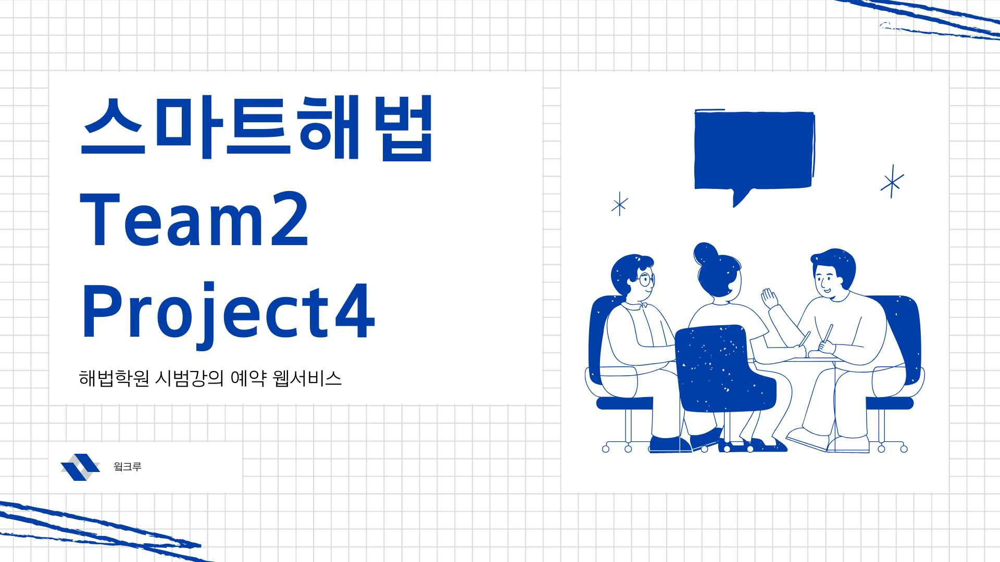
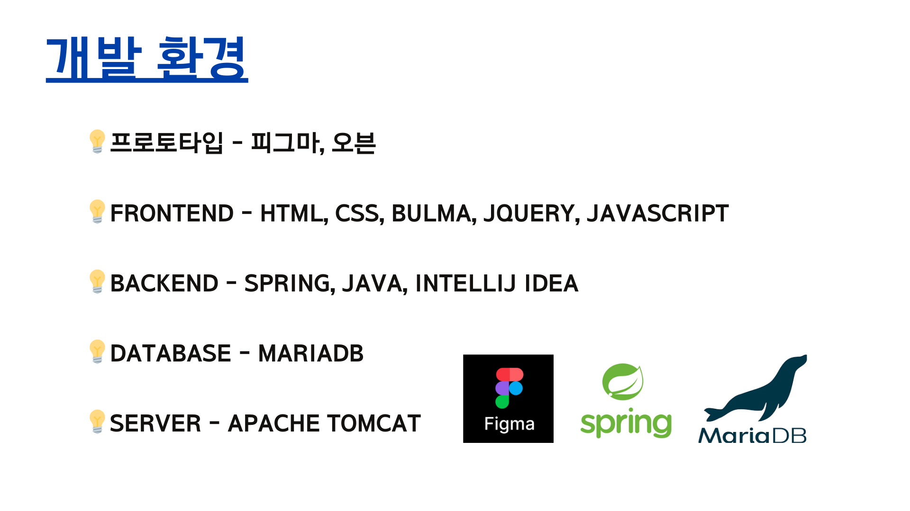
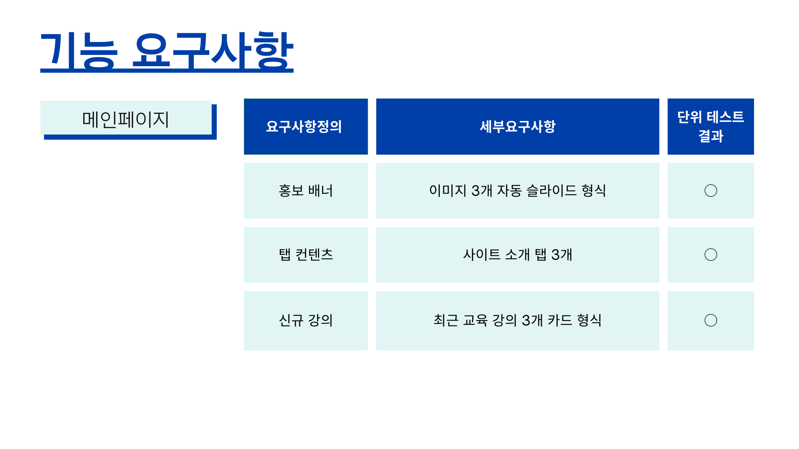
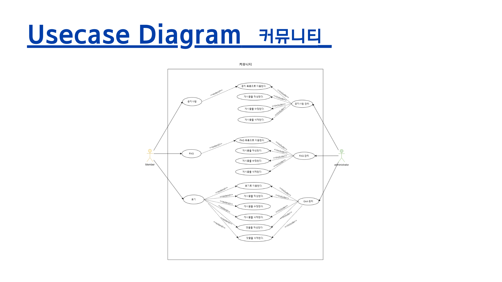
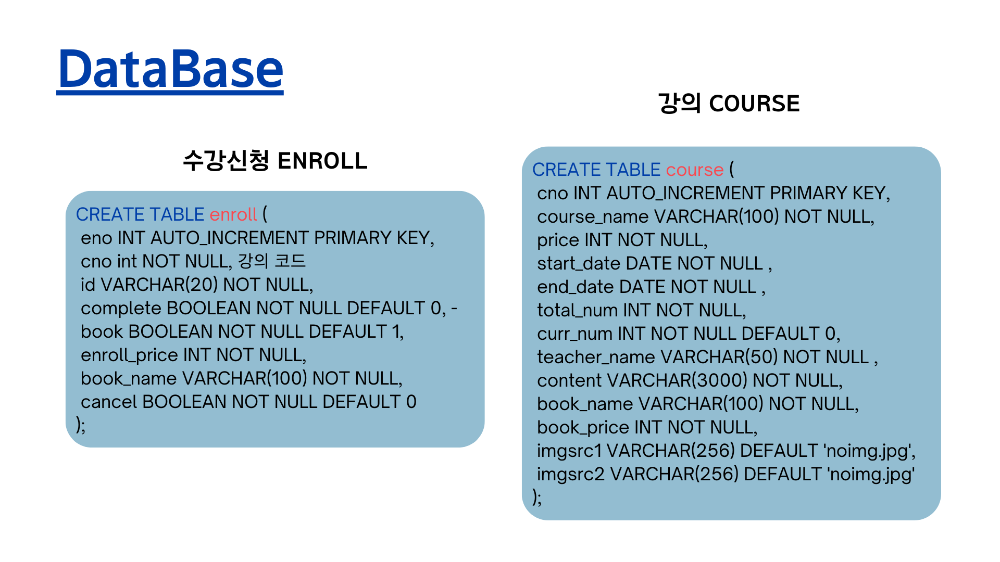

    

# Team24_Fourth Project

천재교육 풀스택 Java 과정 2기 4차 프로젝트입니다.  
<주제: 해법강의 시범강의 웹 서비스 구현>  

<strong>SmartHabeop</strong>은 학생과 학부모가 시범강의를 통해 결제 후 수강 할 수 있는 웹서비스 입니다.  

 

## 주요 기능

 

## 사용 기술

  
 

 

## 참여 인원

| 김가희 | 신수민 | 김상아 |
| --- | --- | --- |
|  |  |  |
| [@soprue](https://github.com/soprue) | [@Shinmilli](https://github.com/Shinmilli) | [@saaaaaaaaaanga](https://github.com/saaaaaaaaaanga) |
| 메인 페이지 로그인 페이지 회원가입 페이지 질병 퀴즈 페이지 | 컴퓨터 교육 페이지 스마트폰 교육 페이지 | 소개 페이지 마이 페이지 |

## Guest 기능 영상

## 회원 가입, 수정 기능 영상

## 회원 수강신청, 후기작성, 자료실 열람 영상

## 관리자 기능 영상

